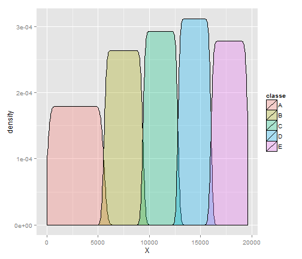
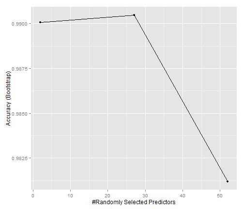

Practical Machine Learning Assignment
========================================================

Outline
-------------
1. Import data
2. Clean data
3. Create training and testing sets
4. Train Random Forest model with Caret
5. Estimate test error


### 1. Import data

```r
set.seed(123)
training<-read.csv('pml-training.csv')
testing<-read.csv('pml-testing.csv')
```
Both sets are now loaded in the workspace.


### 2. Clean data
Necessary packages

```r
library(caret)
library(ggplot2)
```
First look at the actual data.

```r
summary(training)
```

```
##        X            user_name    raw_timestamp_part_1 raw_timestamp_part_2
##  Min.   :    1   adelmo  :3892   Min.   :1.32e+09     Min.   :   294      
##  1st Qu.: 4906   carlitos:3112   1st Qu.:1.32e+09     1st Qu.:252912      
##  Median : 9812   charles :3536   Median :1.32e+09     Median :496380      
##  Mean   : 9812   eurico  :3070   Mean   :1.32e+09     Mean   :500656      
##  3rd Qu.:14717   jeremy  :3402   3rd Qu.:1.32e+09     3rd Qu.:751891      
##  Max.   :19622   pedro   :2610   Max.   :1.32e+09     Max.   :998801      
##                                                                           
##           cvtd_timestamp  new_window    num_window    roll_belt    
##  28/11/2011 14:14: 1498   no :19216   Min.   :  1   Min.   :-28.9  
##  05/12/2011 11:24: 1497   yes:  406   1st Qu.:222   1st Qu.:  1.1  
##  30/11/2011 17:11: 1440               Median :424   Median :113.0  
##  05/12/2011 11:25: 1425               Mean   :431   Mean   : 64.4  
##  02/12/2011 14:57: 1380               3rd Qu.:644   3rd Qu.:123.0  
##  02/12/2011 13:34: 1375               Max.   :864   Max.   :162.0  
##  (Other)         :11007                                            
##    pitch_belt        yaw_belt      total_accel_belt kurtosis_roll_belt
##  Min.   :-55.80   Min.   :-180.0   Min.   : 0.0              :19216   
##  1st Qu.:  1.76   1st Qu.: -88.3   1st Qu.: 3.0     #DIV/0!  :   10   
##  Median :  5.28   Median : -13.0   Median :17.0     -1.908453:    2   
##  Mean   :  0.31   Mean   : -11.2   Mean   :11.3     -0.016850:    1   
##  3rd Qu.: 14.90   3rd Qu.:  12.9   3rd Qu.:18.0     -0.021024:    1   
##  Max.   : 60.30   Max.   : 179.0   Max.   :29.0     -0.025513:    1   
##                                                     (Other)  :  391   
##  kurtosis_picth_belt kurtosis_yaw_belt skewness_roll_belt
##           :19216            :19216              :19216   
##  #DIV/0!  :   32     #DIV/0!:  406     #DIV/0!  :    9   
##  47.000000:    4                       0.000000 :    4   
##  -0.150950:    3                       0.422463 :    2   
##  -0.684748:    3                       -0.003095:    1   
##  -1.750749:    3                       -0.010002:    1   
##  (Other)  :  361                       (Other)  :  389   
##  skewness_roll_belt.1 skewness_yaw_belt max_roll_belt   max_picth_belt 
##           :19216             :19216     Min.   :-94     Min.   : 3     
##  #DIV/0!  :   32      #DIV/0!:  406     1st Qu.:-88     1st Qu.: 5     
##  0.000000 :    4                        Median : -5     Median :18     
##  -2.156553:    3                        Mean   : -7     Mean   :13     
##  -3.072669:    3                        3rd Qu.: 18     3rd Qu.:19     
##  -6.324555:    3                        Max.   :180     Max.   :30     
##  (Other)  :  361                        NA's   :19216   NA's   :19216  
##   max_yaw_belt   min_roll_belt   min_pitch_belt   min_yaw_belt  
##         :19216   Min.   :-180    Min.   : 0             :19216  
##  -1.1   :   30   1st Qu.: -88    1st Qu.: 3      -1.1   :   30  
##  -1.4   :   29   Median :  -8    Median :16      -1.4   :   29  
##  -1.2   :   26   Mean   : -10    Mean   :11      -1.2   :   26  
##  -0.9   :   24   3rd Qu.:   9    3rd Qu.:17      -0.9   :   24  
##  -1.3   :   22   Max.   : 173    Max.   :23      -1.3   :   22  
##  (Other):  275   NA's   :19216   NA's   :19216   (Other):  275  
##  amplitude_roll_belt amplitude_pitch_belt amplitude_yaw_belt
##  Min.   :  0         Min.   : 0                  :19216     
##  1st Qu.:  0         1st Qu.: 1           #DIV/0!:   10     
##  Median :  1         Median : 1           0.00   :   12     
##  Mean   :  4         Mean   : 2           0.0000 :  384     
##  3rd Qu.:  2         3rd Qu.: 2                             
##  Max.   :360         Max.   :12                             
##  NA's   :19216       NA's   :19216                          
##  var_total_accel_belt avg_roll_belt   stddev_roll_belt var_roll_belt  
##  Min.   : 0           Min.   :-27     Min.   : 0       Min.   :  0    
##  1st Qu.: 0           1st Qu.:  1     1st Qu.: 0       1st Qu.:  0    
##  Median : 0           Median :116     Median : 0       Median :  0    
##  Mean   : 1           Mean   : 68     Mean   : 1       Mean   :  8    
##  3rd Qu.: 0           3rd Qu.:123     3rd Qu.: 1       3rd Qu.:  0    
##  Max.   :16           Max.   :157     Max.   :14       Max.   :201    
##  NA's   :19216        NA's   :19216   NA's   :19216    NA's   :19216  
##  avg_pitch_belt  stddev_pitch_belt var_pitch_belt   avg_yaw_belt  
##  Min.   :-51     Min.   :0         Min.   : 0      Min.   :-138   
##  1st Qu.:  2     1st Qu.:0         1st Qu.: 0      1st Qu.: -88   
##  Median :  5     Median :0         Median : 0      Median :  -7   
##  Mean   :  1     Mean   :1         Mean   : 1      Mean   :  -9   
##  3rd Qu.: 16     3rd Qu.:1         3rd Qu.: 0      3rd Qu.:  14   
##  Max.   : 60     Max.   :4         Max.   :16      Max.   : 174   
##  NA's   :19216   NA's   :19216     NA's   :19216   NA's   :19216  
##  stddev_yaw_belt  var_yaw_belt    gyros_belt_x      gyros_belt_y    
##  Min.   :  0     Min.   :    0   Min.   :-1.0400   Min.   :-0.6400  
##  1st Qu.:  0     1st Qu.:    0   1st Qu.:-0.0300   1st Qu.: 0.0000  
##  Median :  0     Median :    0   Median : 0.0300   Median : 0.0200  
##  Mean   :  1     Mean   :  107   Mean   :-0.0056   Mean   : 0.0396  
##  3rd Qu.:  1     3rd Qu.:    0   3rd Qu.: 0.1100   3rd Qu.: 0.1100  
##  Max.   :177     Max.   :31183   Max.   : 2.2200   Max.   : 0.6400  
##  NA's   :19216   NA's   :19216                                      
##   gyros_belt_z     accel_belt_x      accel_belt_y    accel_belt_z   
##  Min.   :-1.460   Min.   :-120.00   Min.   :-69.0   Min.   :-275.0  
##  1st Qu.:-0.200   1st Qu.: -21.00   1st Qu.:  3.0   1st Qu.:-162.0  
##  Median :-0.100   Median : -15.00   Median : 35.0   Median :-152.0  
##  Mean   :-0.130   Mean   :  -5.59   Mean   : 30.1   Mean   : -72.6  
##  3rd Qu.:-0.020   3rd Qu.:  -5.00   3rd Qu.: 61.0   3rd Qu.:  27.0  
##  Max.   : 1.620   Max.   :  85.00   Max.   :164.0   Max.   : 105.0  
##                                                                     
##  magnet_belt_x   magnet_belt_y magnet_belt_z     roll_arm     
##  Min.   :-52.0   Min.   :354   Min.   :-623   Min.   :-180.0  
##  1st Qu.:  9.0   1st Qu.:581   1st Qu.:-375   1st Qu.: -31.8  
##  Median : 35.0   Median :601   Median :-320   Median :   0.0  
##  Mean   : 55.6   Mean   :594   Mean   :-346   Mean   :  17.8  
##  3rd Qu.: 59.0   3rd Qu.:610   3rd Qu.:-306   3rd Qu.:  77.3  
##  Max.   :485.0   Max.   :673   Max.   : 293   Max.   : 180.0  
##                                                               
##    pitch_arm         yaw_arm        total_accel_arm var_accel_arm  
##  Min.   :-88.80   Min.   :-180.00   Min.   : 1.0    Min.   :  0    
##  1st Qu.:-25.90   1st Qu.: -43.10   1st Qu.:17.0    1st Qu.:  9    
##  Median :  0.00   Median :   0.00   Median :27.0    Median : 41    
##  Mean   : -4.61   Mean   :  -0.62   Mean   :25.5    Mean   : 53    
##  3rd Qu.: 11.20   3rd Qu.:  45.88   3rd Qu.:33.0    3rd Qu.: 76    
##  Max.   : 88.50   Max.   : 180.00   Max.   :66.0    Max.   :332    
##                                                     NA's   :19216  
##   avg_roll_arm   stddev_roll_arm  var_roll_arm   avg_pitch_arm  
##  Min.   :-167    Min.   :  0     Min.   :    0   Min.   :-82    
##  1st Qu.: -38    1st Qu.:  1     1st Qu.:    2   1st Qu.:-23    
##  Median :   0    Median :  6     Median :   33   Median :  0    
##  Mean   :  13    Mean   : 11     Mean   :  417   Mean   : -5    
##  3rd Qu.:  76    3rd Qu.: 15     3rd Qu.:  223   3rd Qu.:  8    
##  Max.   : 163    Max.   :162     Max.   :26232   Max.   : 76    
##  NA's   :19216   NA's   :19216   NA's   :19216   NA's   :19216  
##  stddev_pitch_arm var_pitch_arm    avg_yaw_arm    stddev_yaw_arm 
##  Min.   : 0       Min.   :   0    Min.   :-173    Min.   :  0    
##  1st Qu.: 2       1st Qu.:   3    1st Qu.: -29    1st Qu.:  3    
##  Median : 8       Median :  66    Median :   0    Median : 17    
##  Mean   :10       Mean   : 196    Mean   :   2    Mean   : 22    
##  3rd Qu.:16       3rd Qu.: 267    3rd Qu.:  38    3rd Qu.: 36    
##  Max.   :43       Max.   :1885    Max.   : 152    Max.   :177    
##  NA's   :19216    NA's   :19216   NA's   :19216   NA's   :19216  
##   var_yaw_arm     gyros_arm_x      gyros_arm_y      gyros_arm_z   
##  Min.   :    0   Min.   :-6.370   Min.   :-3.440   Min.   :-2.33  
##  1st Qu.:    7   1st Qu.:-1.330   1st Qu.:-0.800   1st Qu.:-0.07  
##  Median :  278   Median : 0.080   Median :-0.240   Median : 0.23  
##  Mean   : 1056   Mean   : 0.043   Mean   :-0.257   Mean   : 0.27  
##  3rd Qu.: 1295   3rd Qu.: 1.570   3rd Qu.: 0.140   3rd Qu.: 0.72  
##  Max.   :31345   Max.   : 4.870   Max.   : 2.840   Max.   : 3.02  
##  NA's   :19216                                                    
##   accel_arm_x      accel_arm_y      accel_arm_z      magnet_arm_x 
##  Min.   :-404.0   Min.   :-318.0   Min.   :-636.0   Min.   :-584  
##  1st Qu.:-242.0   1st Qu.: -54.0   1st Qu.:-143.0   1st Qu.:-300  
##  Median : -44.0   Median :  14.0   Median : -47.0   Median : 289  
##  Mean   : -60.2   Mean   :  32.6   Mean   : -71.2   Mean   : 192  
##  3rd Qu.:  84.0   3rd Qu.: 139.0   3rd Qu.:  23.0   3rd Qu.: 637  
##  Max.   : 437.0   Max.   : 308.0   Max.   : 292.0   Max.   : 782  
##                                                                   
##   magnet_arm_y   magnet_arm_z  kurtosis_roll_arm kurtosis_picth_arm
##  Min.   :-392   Min.   :-597           :19216            :19216    
##  1st Qu.:  -9   1st Qu.: 131   #DIV/0! :   78    #DIV/0! :   80    
##  Median : 202   Median : 444   -0.02438:    1    -0.00484:    1    
##  Mean   : 157   Mean   : 306   -0.04190:    1    -0.01311:    1    
##  3rd Qu.: 323   3rd Qu.: 545   -0.05051:    1    -0.02967:    1    
##  Max.   : 583   Max.   : 694   -0.05695:    1    -0.07394:    1    
##                                (Other) :  324    (Other) :  322    
##  kurtosis_yaw_arm skewness_roll_arm skewness_pitch_arm skewness_yaw_arm
##          :19216           :19216            :19216             :19216  
##  #DIV/0! :   11   #DIV/0! :   77    #DIV/0! :   80     #DIV/0! :   11  
##  0.55844 :    2   -0.00051:    1    -0.00184:    1     -1.62032:    2  
##  0.65132 :    2   -0.00696:    1    -0.01185:    1     0.55053 :    2  
##  -0.01548:    1   -0.01884:    1    -0.01247:    1     -0.00311:    1  
##  -0.01749:    1   -0.03359:    1    -0.02063:    1     -0.00562:    1  
##  (Other) :  389   (Other) :  325    (Other) :  322     (Other) :  389  
##   max_roll_arm   max_picth_arm    max_yaw_arm     min_roll_arm  
##  Min.   :-73     Min.   :-173    Min.   : 4      Min.   :-89    
##  1st Qu.:  0     1st Qu.:  -2    1st Qu.:29      1st Qu.:-42    
##  Median :  5     Median :  23    Median :34      Median :-22    
##  Mean   : 11     Mean   :  36    Mean   :35      Mean   :-21    
##  3rd Qu.: 27     3rd Qu.:  96    3rd Qu.:41      3rd Qu.:  0    
##  Max.   : 86     Max.   : 180    Max.   :65      Max.   : 66    
##  NA's   :19216   NA's   :19216   NA's   :19216   NA's   :19216  
##  min_pitch_arm    min_yaw_arm    amplitude_roll_arm amplitude_pitch_arm
##  Min.   :-180    Min.   : 1      Min.   :  0        Min.   :  0        
##  1st Qu.: -73    1st Qu.: 8      1st Qu.:  5        1st Qu.: 10        
##  Median : -34    Median :13      Median : 28        Median : 55        
##  Mean   : -34    Mean   :15      Mean   : 32        Mean   : 70        
##  3rd Qu.:   0    3rd Qu.:19      3rd Qu.: 51        3rd Qu.:115        
##  Max.   : 152    Max.   :38      Max.   :120        Max.   :360        
##  NA's   :19216   NA's   :19216   NA's   :19216      NA's   :19216      
##  amplitude_yaw_arm roll_dumbbell    pitch_dumbbell    yaw_dumbbell    
##  Min.   : 0        Min.   :-153.7   Min.   :-149.6   Min.   :-150.87  
##  1st Qu.:13        1st Qu.: -18.5   1st Qu.: -40.9   1st Qu.: -77.64  
##  Median :22        Median :  48.2   Median : -21.0   Median :  -3.32  
##  Mean   :21        Mean   :  23.8   Mean   : -10.8   Mean   :   1.67  
##  3rd Qu.:29        3rd Qu.:  67.6   3rd Qu.:  17.5   3rd Qu.:  79.64  
##  Max.   :52        Max.   : 153.6   Max.   : 149.4   Max.   : 154.95  
##  NA's   :19216                                                        
##  kurtosis_roll_dumbbell kurtosis_picth_dumbbell kurtosis_yaw_dumbbell
##         :19216                 :19216                  :19216        
##  #DIV/0!:    5          -0.5464:    2           #DIV/0!:  406        
##  -0.2583:    2          -0.9334:    2                                
##  -0.3705:    2          -2.0833:    2                                
##  -0.5855:    2          -2.0851:    2                                
##  -2.0851:    2          -2.0889:    2                                
##  (Other):  393          (Other):  396                                
##  skewness_roll_dumbbell skewness_pitch_dumbbell skewness_yaw_dumbbell
##         :19216                 :19216                  :19216        
##  #DIV/0!:    4          -0.2328:    2           #DIV/0!:  406        
##  -0.9324:    2          -0.3521:    2                                
##  0.1110 :    2          -0.7036:    2                                
##  1.0312 :    2          0.1090 :    2                                
##  -0.0082:    1          1.0326 :    2                                
##  (Other):  395          (Other):  396                                
##  max_roll_dumbbell max_picth_dumbbell max_yaw_dumbbell min_roll_dumbbell
##  Min.   :-70       Min.   :-113              :19216    Min.   :-150     
##  1st Qu.:-27       1st Qu.: -67       -0.6   :   20    1st Qu.: -60     
##  Median : 15       Median :  40       0.2    :   19    Median : -44     
##  Mean   : 14       Mean   :  33       -0.8   :   18    Mean   : -41     
##  3rd Qu.: 51       3rd Qu.: 133       -0.3   :   16    3rd Qu.: -25     
##  Max.   :137       Max.   : 155       -0.2   :   15    Max.   :  73     
##  NA's   :19216     NA's   :19216      (Other):  318    NA's   :19216    
##  min_pitch_dumbbell min_yaw_dumbbell amplitude_roll_dumbbell
##  Min.   :-147              :19216    Min.   :  0            
##  1st Qu.: -92       -0.6   :   20    1st Qu.: 15            
##  Median : -66       0.2    :   19    Median : 35            
##  Mean   : -33       -0.8   :   18    Mean   : 55            
##  3rd Qu.:  21       -0.3   :   16    3rd Qu.: 81            
##  Max.   : 121       -0.2   :   15    Max.   :256            
##  NA's   :19216      (Other):  318    NA's   :19216          
##  amplitude_pitch_dumbbell amplitude_yaw_dumbbell total_accel_dumbbell
##  Min.   :  0                     :19216          Min.   : 0.0        
##  1st Qu.: 17              #DIV/0!:    5          1st Qu.: 4.0        
##  Median : 42              0.00   :  401          Median :10.0        
##  Mean   : 66                                     Mean   :13.7        
##  3rd Qu.:100                                     3rd Qu.:19.0        
##  Max.   :274                                     Max.   :58.0        
##  NA's   :19216                                                       
##  var_accel_dumbbell avg_roll_dumbbell stddev_roll_dumbbell
##  Min.   :  0        Min.   :-129      Min.   :  0         
##  1st Qu.:  0        1st Qu.: -12      1st Qu.:  5         
##  Median :  1        Median :  48      Median : 12         
##  Mean   :  4        Mean   :  24      Mean   : 21         
##  3rd Qu.:  3        3rd Qu.:  64      3rd Qu.: 26         
##  Max.   :230        Max.   : 126      Max.   :124         
##  NA's   :19216      NA's   :19216     NA's   :19216       
##  var_roll_dumbbell avg_pitch_dumbbell stddev_pitch_dumbbell
##  Min.   :    0     Min.   :-71        Min.   : 0           
##  1st Qu.:   22     1st Qu.:-42        1st Qu.: 3           
##  Median :  149     Median :-20        Median : 8           
##  Mean   : 1020     Mean   :-12        Mean   :13           
##  3rd Qu.:  695     3rd Qu.: 13        3rd Qu.:19           
##  Max.   :15321     Max.   : 94        Max.   :83           
##  NA's   :19216     NA's   :19216      NA's   :19216        
##  var_pitch_dumbbell avg_yaw_dumbbell stddev_yaw_dumbbell var_yaw_dumbbell
##  Min.   :   0       Min.   :-118     Min.   :  0         Min.   :    0   
##  1st Qu.:  12       1st Qu.: -77     1st Qu.:  4         1st Qu.:   15   
##  Median :  65       Median :  -5     Median : 10         Median :  105   
##  Mean   : 350       Mean   :   0     Mean   : 17         Mean   :  590   
##  3rd Qu.: 370       3rd Qu.:  71     3rd Qu.: 25         3rd Qu.:  609   
##  Max.   :6836       Max.   : 135     Max.   :107         Max.   :11468   
##  NA's   :19216      NA's   :19216    NA's   :19216       NA's   :19216   
##  gyros_dumbbell_x  gyros_dumbbell_y gyros_dumbbell_z accel_dumbbell_x
##  Min.   :-204.00   Min.   :-2.10    Min.   : -2.4    Min.   :-419.0  
##  1st Qu.:  -0.03   1st Qu.:-0.14    1st Qu.: -0.3    1st Qu.: -50.0  
##  Median :   0.13   Median : 0.03    Median : -0.1    Median :  -8.0  
##  Mean   :   0.16   Mean   : 0.05    Mean   : -0.1    Mean   : -28.6  
##  3rd Qu.:   0.35   3rd Qu.: 0.21    3rd Qu.:  0.0    3rd Qu.:  11.0  
##  Max.   :   2.22   Max.   :52.00    Max.   :317.0    Max.   : 235.0  
##                                                                      
##  accel_dumbbell_y accel_dumbbell_z magnet_dumbbell_x magnet_dumbbell_y
##  Min.   :-189.0   Min.   :-334.0   Min.   :-643      Min.   :-3600    
##  1st Qu.:  -8.0   1st Qu.:-142.0   1st Qu.:-535      1st Qu.:  231    
##  Median :  41.5   Median :  -1.0   Median :-479      Median :  311    
##  Mean   :  52.6   Mean   : -38.3   Mean   :-328      Mean   :  221    
##  3rd Qu.: 111.0   3rd Qu.:  38.0   3rd Qu.:-304      3rd Qu.:  390    
##  Max.   : 315.0   Max.   : 318.0   Max.   : 592      Max.   :  633    
##                                                                       
##  magnet_dumbbell_z  roll_forearm     pitch_forearm     yaw_forearm    
##  Min.   :-262.0    Min.   :-180.00   Min.   :-72.50   Min.   :-180.0  
##  1st Qu.: -45.0    1st Qu.:  -0.74   1st Qu.:  0.00   1st Qu.: -68.6  
##  Median :  13.0    Median :  21.70   Median :  9.24   Median :   0.0  
##  Mean   :  46.1    Mean   :  33.83   Mean   : 10.71   Mean   :  19.2  
##  3rd Qu.:  95.0    3rd Qu.: 140.00   3rd Qu.: 28.40   3rd Qu.: 110.0  
##  Max.   : 452.0    Max.   : 180.00   Max.   : 89.80   Max.   : 180.0  
##                                                                       
##  kurtosis_roll_forearm kurtosis_picth_forearm kurtosis_yaw_forearm
##         :19216                :19216                 :19216       
##  #DIV/0!:   84         #DIV/0!:   85          #DIV/0!:  406       
##  -0.8079:    2         -0.0073:    1                              
##  -0.9169:    2         -0.0442:    1                              
##  -0.0227:    1         -0.0489:    1                              
##  -0.0359:    1         -0.0523:    1                              
##  (Other):  316         (Other):  317                              
##  skewness_roll_forearm skewness_pitch_forearm skewness_yaw_forearm
##         :19216                :19216                 :19216       
##  #DIV/0!:   83         #DIV/0!:   85          #DIV/0!:  406       
##  -0.1912:    2         0.0000 :    4                              
##  -0.4126:    2         -0.6992:    2                              
##  -0.0004:    1         -0.0113:    1                              
##  -0.0013:    1         -0.0131:    1                              
##  (Other):  317         (Other):  313                              
##  max_roll_forearm max_picth_forearm max_yaw_forearm min_roll_forearm
##  Min.   :-67      Min.   :-151             :19216   Min.   :-72     
##  1st Qu.:  0      1st Qu.:   0      #DIV/0!:   84   1st Qu.: -6     
##  Median : 27      Median : 113      -1.2   :   32   Median :  0     
##  Mean   : 24      Mean   :  81      -1.3   :   31   Mean   :  0     
##  3rd Qu.: 46      3rd Qu.: 175      -1.4   :   24   3rd Qu.: 12     
##  Max.   : 90      Max.   : 180      -1.5   :   24   Max.   : 62     
##  NA's   :19216    NA's   :19216     (Other):  211   NA's   :19216   
##  min_pitch_forearm min_yaw_forearm amplitude_roll_forearm
##  Min.   :-180             :19216   Min.   :  0           
##  1st Qu.:-175      #DIV/0!:   84   1st Qu.:  1           
##  Median : -61      -1.2   :   32   Median : 18           
##  Mean   : -58      -1.3   :   31   Mean   : 25           
##  3rd Qu.:   0      -1.4   :   24   3rd Qu.: 40           
##  Max.   : 167      -1.5   :   24   Max.   :126           
##  NA's   :19216     (Other):  211   NA's   :19216         
##  amplitude_pitch_forearm amplitude_yaw_forearm total_accel_forearm
##  Min.   :  0                    :19216         Min.   :  0.0      
##  1st Qu.:  2             #DIV/0!:   84         1st Qu.: 29.0      
##  Median : 84             0.00   :  322         Median : 36.0      
##  Mean   :139                                   Mean   : 34.7      
##  3rd Qu.:350                                   3rd Qu.: 41.0      
##  Max.   :360                                   Max.   :108.0      
##  NA's   :19216                                                    
##  var_accel_forearm avg_roll_forearm stddev_roll_forearm var_roll_forearm
##  Min.   :  0       Min.   :-177     Min.   :  0         Min.   :    0   
##  1st Qu.:  7       1st Qu.:  -1     1st Qu.:  0         1st Qu.:    0   
##  Median : 21       Median :  11     Median :  8         Median :   64   
##  Mean   : 34       Mean   :  33     Mean   : 42         Mean   : 5274   
##  3rd Qu.: 51       3rd Qu.: 107     3rd Qu.: 85         3rd Qu.: 7289   
##  Max.   :173       Max.   : 177     Max.   :179         Max.   :32102   
##  NA's   :19216     NA's   :19216    NA's   :19216       NA's   :19216   
##  avg_pitch_forearm stddev_pitch_forearm var_pitch_forearm avg_yaw_forearm
##  Min.   :-68       Min.   : 0           Min.   :   0      Min.   :-155   
##  1st Qu.:  0       1st Qu.: 0           1st Qu.:   0      1st Qu.: -26   
##  Median : 12       Median : 6           Median :  30      Median :   0   
##  Mean   : 12       Mean   : 8           Mean   : 140      Mean   :  18   
##  3rd Qu.: 28       3rd Qu.:13           3rd Qu.: 166      3rd Qu.:  86   
##  Max.   : 72       Max.   :48           Max.   :2280      Max.   : 169   
##  NA's   :19216     NA's   :19216        NA's   :19216     NA's   :19216  
##  stddev_yaw_forearm var_yaw_forearm gyros_forearm_x   gyros_forearm_y 
##  Min.   :  0        Min.   :    0   Min.   :-22.000   Min.   : -7.02  
##  1st Qu.:  1        1st Qu.:    0   1st Qu.: -0.220   1st Qu.: -1.46  
##  Median : 25        Median :  612   Median :  0.050   Median :  0.03  
##  Mean   : 45        Mean   : 4640   Mean   :  0.158   Mean   :  0.08  
##  3rd Qu.: 86        3rd Qu.: 7368   3rd Qu.:  0.560   3rd Qu.:  1.62  
##  Max.   :198        Max.   :39009   Max.   :  3.970   Max.   :311.00  
##  NA's   :19216      NA's   :19216                                     
##  gyros_forearm_z  accel_forearm_x  accel_forearm_y accel_forearm_z 
##  Min.   : -8.09   Min.   :-498.0   Min.   :-632    Min.   :-446.0  
##  1st Qu.: -0.18   1st Qu.:-178.0   1st Qu.:  57    1st Qu.:-182.0  
##  Median :  0.08   Median : -57.0   Median : 201    Median : -39.0  
##  Mean   :  0.15   Mean   : -61.7   Mean   : 164    Mean   : -55.3  
##  3rd Qu.:  0.49   3rd Qu.:  76.0   3rd Qu.: 312    3rd Qu.:  26.0  
##  Max.   :231.00   Max.   : 477.0   Max.   : 923    Max.   : 291.0  
##                                                                    
##  magnet_forearm_x magnet_forearm_y magnet_forearm_z classe  
##  Min.   :-1280    Min.   :-896     Min.   :-973     A:5580  
##  1st Qu.: -616    1st Qu.:   2     1st Qu.: 191     B:3797  
##  Median : -378    Median : 591     Median : 511     C:3422  
##  Mean   : -313    Mean   : 380     Mean   : 394     D:3216  
##  3rd Qu.:  -73    3rd Qu.: 737     3rd Qu.: 653     E:3607  
##  Max.   :  672    Max.   :1480     Max.   :1090             
## 
```
We can see that many predictors have predominantly missing entries (NA). The corresponding columns will be removed from both sets by:

```r
subset.NAs<-sapply(training,function(x)sum(is.na(x))<19000)
training.nona<-(training[,subset.NAs])
testing.nona<-testing[,subset.NAs]
```
Many other columns have near zero variance and will be removed as well.

```r
nzv<-nearZeroVar(training.nona)
training.nona.nonzv<-training.nona[, -nzv]
testing.nona.nonzv<-testing.nona[, -nzv]
```

The data.frame is ordered by outcome and shows perfect correlation with variable 'X', which is an index variable. This correlation is therefore fake and X has to be removed.
Similarly, variable 'num_window' is some kind of rolling count variable and will be removed.


```r
ggplot(training.nona.nonzv, aes_string(x='X' , fill='classe '))+ geom_density(alpha=.3)
```

 

4 variables seem to be user or time specific (*user_name*, *raw_timestamp_part_1*, *raw_timestamp_part_2*, *cvtd_timestamp*) and will be removed as well because they do not generalize to new data in the future.


```r
training.nona.nonzv.nofake<-training.nona.nonzv[,-c(1:6)]
testing.nona.nonzv.nofake<-testing.nona.nonzv[,-c(1:6)]
```


```r
sapply(training.nona.nonzv.nofake,class)
```

```
##            roll_belt           pitch_belt             yaw_belt 
##            "numeric"            "numeric"            "numeric" 
##     total_accel_belt         gyros_belt_x         gyros_belt_y 
##            "integer"            "numeric"            "numeric" 
##         gyros_belt_z         accel_belt_x         accel_belt_y 
##            "numeric"            "integer"            "integer" 
##         accel_belt_z        magnet_belt_x        magnet_belt_y 
##            "integer"            "integer"            "integer" 
##        magnet_belt_z             roll_arm            pitch_arm 
##            "integer"            "numeric"            "numeric" 
##              yaw_arm      total_accel_arm          gyros_arm_x 
##            "numeric"            "integer"            "numeric" 
##          gyros_arm_y          gyros_arm_z          accel_arm_x 
##            "numeric"            "numeric"            "integer" 
##          accel_arm_y          accel_arm_z         magnet_arm_x 
##            "integer"            "integer"            "integer" 
##         magnet_arm_y         magnet_arm_z        roll_dumbbell 
##            "integer"            "integer"            "numeric" 
##       pitch_dumbbell         yaw_dumbbell total_accel_dumbbell 
##            "numeric"            "numeric"            "integer" 
##     gyros_dumbbell_x     gyros_dumbbell_y     gyros_dumbbell_z 
##            "numeric"            "numeric"            "numeric" 
##     accel_dumbbell_x     accel_dumbbell_y     accel_dumbbell_z 
##            "integer"            "integer"            "integer" 
##    magnet_dumbbell_x    magnet_dumbbell_y    magnet_dumbbell_z 
##            "integer"            "integer"            "numeric" 
##         roll_forearm        pitch_forearm          yaw_forearm 
##            "numeric"            "numeric"            "numeric" 
##  total_accel_forearm      gyros_forearm_x      gyros_forearm_y 
##            "integer"            "numeric"            "numeric" 
##      gyros_forearm_z      accel_forearm_x      accel_forearm_y 
##            "numeric"            "integer"            "integer" 
##      accel_forearm_z     magnet_forearm_x     magnet_forearm_y 
##            "integer"            "integer"            "numeric" 
##     magnet_forearm_z               classe 
##            "numeric"             "factor"
```

```r
dim(training.nona.nonzv.nofake)
```

```
## [1] 19622    53
```
Only integer and numeric variables remain... great! 

We now have 19622 observations in 53 columns. 52 columns are predictors, the last column is the class assignment

### 3. Create training and testing sets
The supplied training set has many observations relative to the number of predictors. We will split it to have a separate training and testing set with known classes. Accuracy of the model can then be estimated by our own testing set. 


```r
my.subset.train<-createDataPartition(training.nona.nonzv.nofake$classe, p = .8,
                    list = FALSE)
my.subset.training<-training.nona.nonzv.nofake[my.subset.train,]
my.subset.testing<-training.nona.nonzv.nofake[-my.subset.train,]
```
### 4. Train Random Forest model with Caret

Allow R to use 3 cpu cores if possible on a windows machine.

```r
library(doParallel)
cl<-detectCores()
registerDoParallel(cl-1)
```
Fit the Random Forest on the generated training set with standard settings in caret.

```r
fit.rf<-train(classe~.,method='rf', data=my.subset.training)
# this takes about 28 minutes on a core i5 with 12GB of RAM.
```


### 5. Estimate test error

Caret uses 25 bootstrap samples and tests three different parameters for 'mtry' as a default setting. 

```r
fit.rf
```

```
## Random Forest 
## 
## 15699 samples
##    52 predictors
##     5 classes: 'A', 'B', 'C', 'D', 'E' 
## 
## No pre-processing
## Resampling: Bootstrapped (25 reps) 
## 
## Summary of sample sizes: 15699, 15699, 15699, 15699, 15699, 15699, ... 
## 
## Resampling results across tuning parameters:
## 
##   mtry  Accuracy  Kappa  Accuracy SD  Kappa SD
##   2     1         1      0.002        0.002   
##   30    1         1      0.002        0.002   
##   50    1         1      0.004        0.005   
## 
## Accuracy was used to select the optimal model using  the largest value.
## The final value used for the model was mtry = 27.
```


```r
ggplot(fit.rf)
```

 


The estimated accuracy is well above 99% for mtry=2.

We can now estimate the testing accuracy idependently from the model estimate with our held out test set.

```r
confusionMatrix(table(predict(fit.rf,newdata=my.subset.testing),my.subset.testing$classe))
```

```
## Confusion Matrix and Statistics
## 
##    
##        A    B    C    D    E
##   A 1115    8    0    0    0
##   B    1  749    1    0    0
##   C    0    2  680    3    0
##   D    0    0    3  639    1
##   E    0    0    0    1  720
## 
## Overall Statistics
##                                         
##                Accuracy : 0.995         
##                  95% CI : (0.992, 0.997)
##     No Information Rate : 0.284         
##     P-Value [Acc > NIR] : <2e-16        
##                                         
##                   Kappa : 0.994         
##  Mcnemar's Test P-Value : NA            
## 
## Statistics by Class:
## 
##                      Class: A Class: B Class: C Class: D Class: E
## Sensitivity             0.999    0.987    0.994    0.994    0.999
## Specificity             0.997    0.999    0.998    0.999    1.000
## Pos Pred Value          0.993    0.997    0.993    0.994    0.999
## Neg Pred Value          1.000    0.997    0.999    0.999    1.000
## Prevalence              0.284    0.193    0.174    0.164    0.184
## Detection Rate          0.284    0.191    0.173    0.163    0.184
## Detection Prevalence    0.286    0.191    0.175    0.164    0.184
## Balanced Accuracy       0.998    0.993    0.996    0.996    0.999
```

The best estimate for the test error on new data is 99.4902%.

On the supplied testing set, the model correctly predicts all 20 examples.
